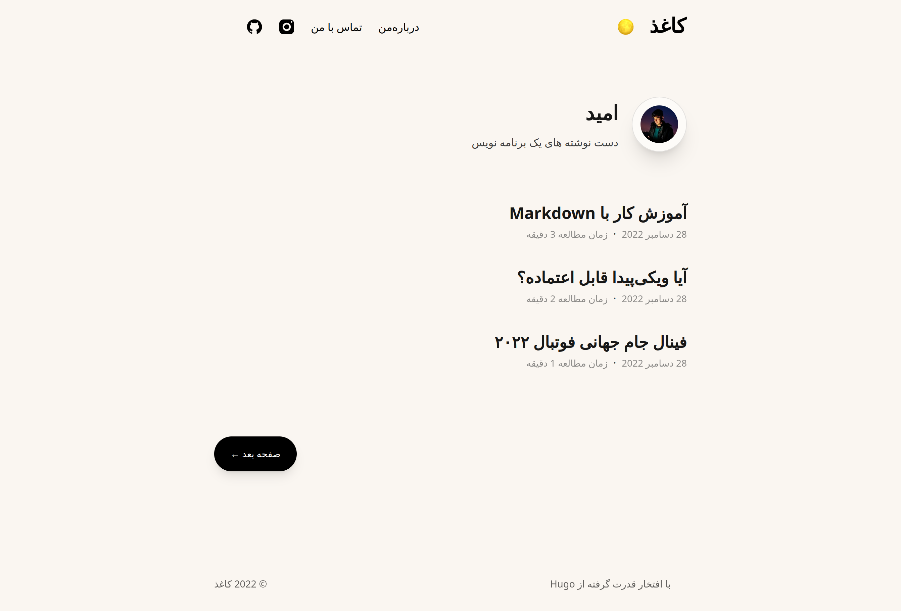
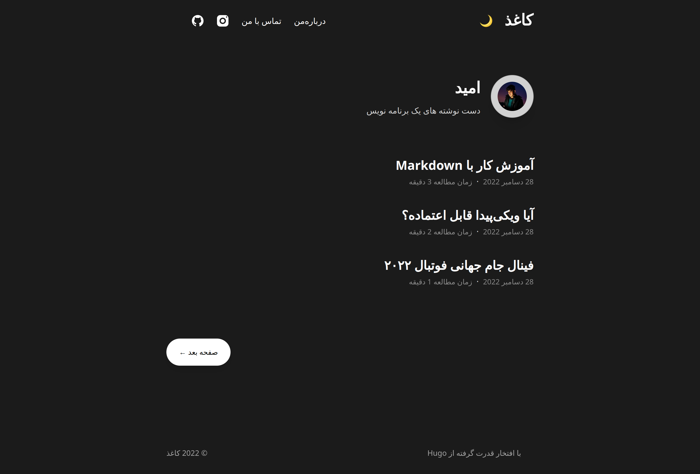
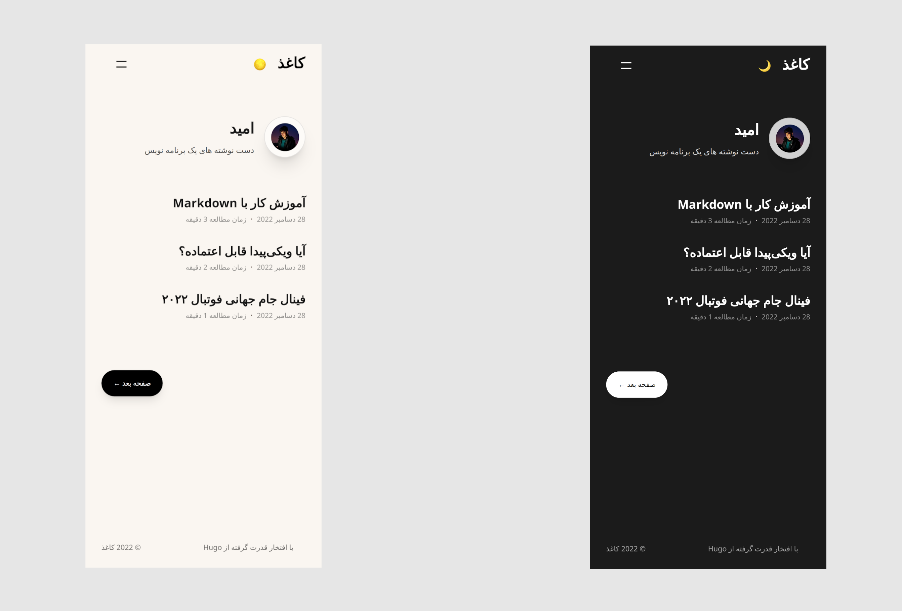

# Paper-RTL
<div dir="rtl">
<div align="center">
    <small>
    <p>
    یک قالب ساده، سریع و انعطاف پذیز برای Hugo
    </p>
    </small>
    <small>
    <p>
        <a href="https://techwithomid.github.io/paper-rtl-demo">مشاهده دمو</a>
    </p>
    </small>
</div>
<br/>
<br/>
فورک راستچین و مناسب زبان فارسی قالب <a href="https://github.com/nanxiaobei/hugo-paper">Paper</a>

## پیش نمایش





## نصب
داخل پروژه‌ی Hugo خود دستور زیر را اجرا کنید:

```bash
git submodule add https://github.com/techwithomid/hugo-paper-rtl themes/paper-rtl
```
سپس فایل ‍‍`config.toml` را اجرا کنید و مقدار `theme` را به `paper-rtl` تغییر دهید:
```bash
theme = "paper-rtl"
```
برای اطلاعات بیشتر به <a href="https://gohugo.io/getting-started/quick-start/#step-3-add-a-theme">مستندات Hugo</a> مراجعه کنید.
## گزینه ها
پیشنهاد می‌شود که از فایل `config.toml` بخش `exampleSite` استفاده کنید و مقادیر را به دلخواه تغییر دهید.

گزینه های قابل ارائه در `config.toml`:
</div>

```toml
disqusShortname = 'YOUR_DISQUS_SHORTNAME'   # add disqus comments

[params]
  # color style
  color = 'linen'                   # linen, wheat, gray, light

  # header social icons
  twitter = 'YOUR_TWITTER_ID'       # twitter.com/YOUR_TWITTER_ID
  github = 'YOUR_GITHUB_ID'         # github.com/YOUR_GITHUB_ID
  instagram = 'YOUR_INSTAGRAM_ID'   # instagram.com/YOUR_INSTAGRAM_ID
  mastodon = 'YOUR_MASTODON_LINK'   # e.g. 'https://mastodon.instance/@xxx'
  rss = true                        # show rss icon

  # home page profile
  avatar = 'GRAVATAR_EMAIL'         # Gravatar email or image url
  name = 'YOUR_NAME'
  bio = 'YOUR_BIO'

  # misc
  disableHLJS = true                # disable requesting highlight.js
  monoDarkIcon = true               # show monochrome dark mode icon
  gravatarCdn = 'GRAVATAR_CDN_LINK' # e.g. 'https://cdn.v2ex.com/gravatar/'
```
<div dir="rtl">

## مشارکت
برای مشارکت در توسعه این قالب اولویت با لیست کارهاست اما می‌توانید قابلیت مورد نیاز خود را اضافه کنید و contribute کنید.

## لیست کارها
- اضافه کردن فونت وزیر
- اضافه کردن README انگلیسی
- منتشر کردن قالب در hugo theme
- اضافه کردن دکمه رفتن به بالای صفحه

</div>
